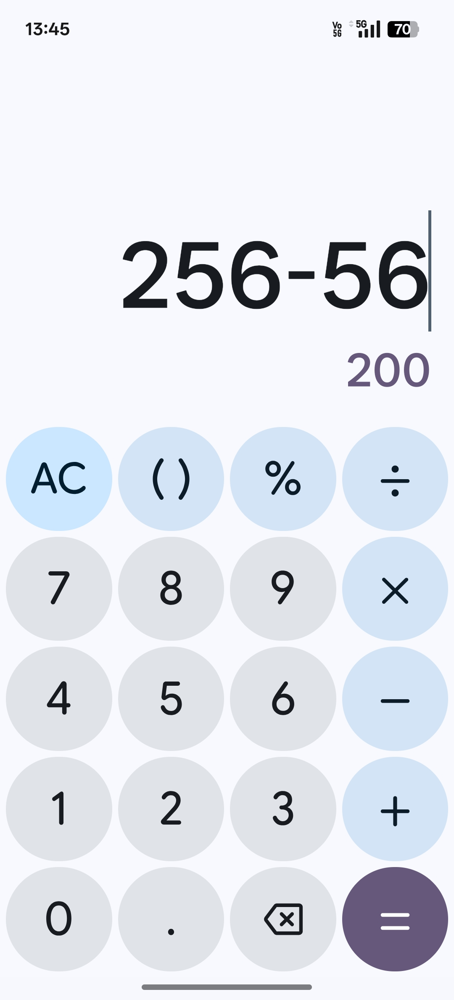
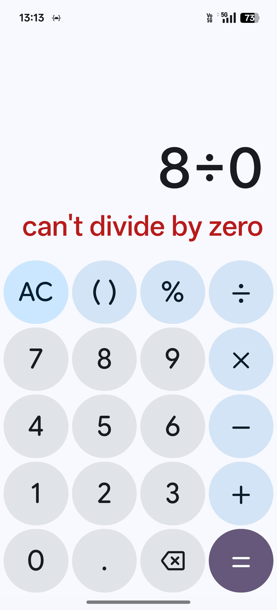

# FeatherCalc 🧮

A modern, native Android calculator built with **Kotlin** and **Material 3**, engineered for robust mathematical accuracy and superior stability in handling complex user interactions.

## ✨ Features & Highlights

* **Logic Resilience:** Engineered to prevent crashes from common state errors, such as continuous operation after a `Division by Zero` error.
* **Accurate Arithmetic Engine:** Supports complex expressions, including correct handling of **implicit multiplication** (e.g., `2(3+1)`) and advanced percentage calculations (`100 + 10%`).
* **Modern UX/UI:** Clean, expressive interface built using Google's Material 3 design guidelines.
* **Advanced State Management:** Utilizes a decoupled `Controller-Engine` architecture for maintaining state, ensuring expressions, results, and cursor positions are stable across screen rotations and application restarts.

## 📱 Screenshots

| Live Calculation | Error State Handling |
| :---: | :---: |
|  |  |

## ⬇️ Installation

The latest production APK is always available via GitHub Releases.

1.  Go to the **[Releases page](https://github.com/myselfkshitiz/FeatherCalc/releases)**.
2.  Download the latest `app-release-vX.X.apk` file.
3.  Install the APK on your Android device.

## 🏗️ Technology Stack

* **Language:** Kotlin
* **Framework:** Android SDK
* **Design:** Material 3
* **Architecture:** Clean separation between UI, Controller, and decoupled `CalculatorEngine`.
* **CI/CD:** GitHub Actions for automated building and testing.

## 🤝 Contribution

Contributions are welcome! If you find a bug (especially a complex interaction or crash condition), please open an issue.

For major features or structural changes, please open an issue first to discuss what you would like to change.

## 📄 License

This project is licensed under the MIT License - see the [LICENSE](LICENSE) file for details.

